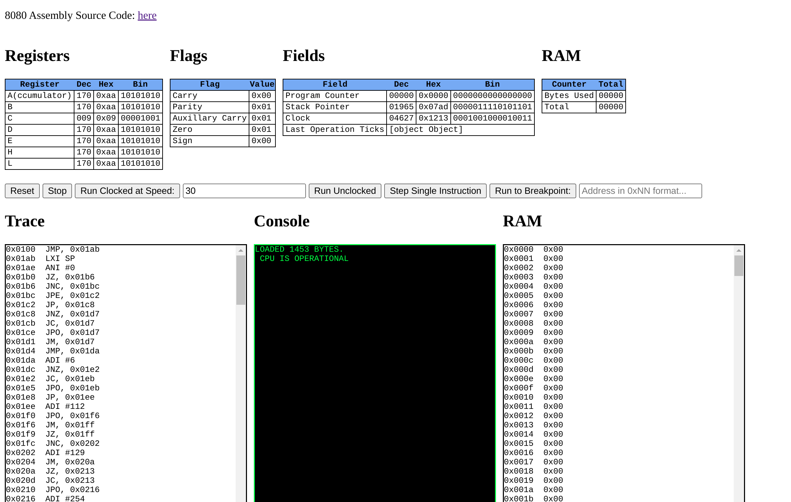
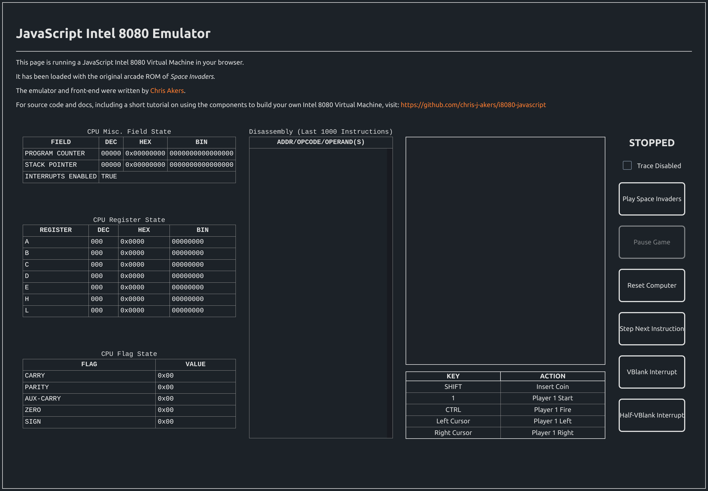

# Intel 8080 JavaScript Emulator <!-- omit in toc -->

This Repo contains the following:

* An Intel 8080 CPU emulator written in JavaScript, plus additional components that can be used to build a virtual machine with the Intel 8080 as its processor.

* A *Space Invaders* emulator which runs the original 1978 game ROM in a modern web browser with a *React*-based front-end. To see this in action, visit: http://8080.cakers.io.

* A *CPU Diag* emulator that also runs on the 8080 virtual machine components. This is a piece of software written in 1980 by Kelly Smith of *Microcosm Associates*. It tests the 8080 chip is in full working order. The version in this repo runs in a simple static website and requires a running web-server to use (albeit a small, simple one such as 'live-server' or `python -m SimpleHttpServer`).

* Unit tests for nearly all of the 8080 operations in *Mocha* format
* The Unit Test Generator App
* An app to convert 8080 ROM binary files into JavaScript arrays of bytes.

---

### Table of Contents <!-- omit in toc -->

- [1. Why JavaScript?](#1-why-javascript)
- [2. 8080 Core Components](#2-8080-core-components)
  - [2.1. `i8080.js`](#21-i8080js)
  - [2.2. `mmu.js`](#22-mmujs)
  - [2.3. `bus.js`](#23-busjs)
  - [2.4. `device.js`](#24-devicejs)
  - [2.5. Core Component Class Diagram](#25-core-component-class-diagram)
- [3. Testing](#3-testing)
  - [3.1. Unit Tests](#31-unit-tests)
  - [3.2. Running Unit Tests](#32-running-unit-tests)
  - [3.3. Unit Test Methodology](#33-unit-test-methodology)
  - [3.4. CPU Diag (1980)](#34-cpu-diag-1980)
- [4. Implementing Space Invaders](#4-implementing-space-invaders)
  - [4.1. Components](#41-components)
  - [4.2. Space Invaders Class Diagram](#42-space-invaders-class-diagram)
  - [4.3. Video](#43-video)
    - [4.3.1. The Video Buffer](#431-the-video-buffer)
    - [4.3.2. Colour Palette](#432-colour-palette)
    - [4.3.3. Roated Screen](#433-roated-screen)
  - [4.4. Additional Hardware](#44-additional-hardware)
    - [4.4.1. Bit-Shift Device](#441-bit-shift-device)
    - [4.4.2. Controller Devices](#442-controller-devices)
  - [4.5. Game Loop Implementation and the Web Worker](#45-game-loop-implementation-and-the-web-worker)
  - [4.6. Front-End](#46-front-end)
    - [4.6.1. Control Panel](#461-control-panel)
    - [4.6.2. Data Tables](#462-data-tables)
      - [4.6.2.1. Field State](#4621-field-state)
      - [4.6.2.2. CPU Register State](#4622-cpu-register-state)
      - [4.6.2.3. CPU Flag State](#4623-cpu-flag-state)
    - [4.6.3. Disassembly](#463-disassembly)
    - [4.6.4. Game Window](#464-game-window)
- [5. References and Sources](#5-references-and-sources)

---
# 1. Why JavaScript?

Originally, this project was started in `C`. After all, research suggested this was the language most people wrote their emulators in and would also serve to illustrate just how fucking hard-core I was when it comes to programming, but a few issues presented themselves early on:

- Emulating 8080 software, in particular games, means drawing graphics and controlling sprites. For C, some sort of display library like `SDL` would need to be used and, therefore, studied, whereas a modern web browser has all that capability built-in and can easily controlled using a well-known and ubiquitous scripting language.

- This is a personal research project, but I still want people to be able to access a demo easily without having to download an executable and deal with all those hand-wringing secuity issues, plus I didn't want to have to provide a set of executables for different OS types. This way, I can just stick it on the web. For instance, here: [http://8080.cakers.io](http://8080.cakers.io).

- Chromium-based browsers have great dev tools built in. It was either that or spending some more quality time with `GDB` which - and I'm sorry - just isn't pretty enough.

- Time is a factor. I have a family and work on the emulator could only really be done when a couple of hours were snatched each evening or during nap-time (the baby's, not mine). I didn't want to spend those precious few hours chasing down endless, fucking segmentation errors. A high-level language with great, visual debugging tools available is far better suited to this endevour.

---
# 2. 8080 Core Components

In `/src/core`, the following JavaScript classes can be used to form a simple virtual machine with an 8080 CPU at its core. 

## 2.1. `i8080.js`

The 8080 CPU component which emulates all 8080 operations and contains a few debug functions that output strings related to the current state of the CPU.

## 2.2. `mmu.js`

A simple class used to hold RAM (in a `Number` `Array`) and provides an interface for reading and writing to the RAM.

## 2.3. `bus.js`

A class used to connect the CPU, MMU and any additional devices together. CPU operations that use RAM, for instance, only interact with the bus which passes the request to the `MMU`.

Devices are added to `Read` and `Write` arrays in positions that reflect the ports they are hooked up to. For instance, the 'Space Invaders' custom bit-shift device (see below) is added to the `Read` array at positions `2` and `4` and the `Write` array at position `3` because these are the three ports it uses to communicate with the CPU via the `IN` and `OUT` opcodes.

## 2.4. `device.js`

An abstract class that provides an interface for any device that needs to be connected to the bus. Basically, it just ensures each device provides a `Read()` and a `Write()` method. It can't be instantiated directly.

## 2.5. Core Component Class Diagram

Core components and their relationships are below. Click for full-size.


---
# 3. Testing

## 3.1. Unit Tests 

Unit tests cover nearly all the 8080 operations. They are automatically generated by the `test_generator.py` application found in `/utils` which reads in a set of `YAML` config files to generate *Mocha* test suites. This simple application saves a lot of time in maintaining unit tests that contain very similar boilerplate code but expect slightly different results.

To generate:

```shell
cd utils/test_generator
python3 ./gen_i8080_unit_tests.py
```

## 3.2. Running Unit Tests
Unit tests are written to: `/src/unit_tests` and require Mocha to run (`npm install`). To execute all tests, should be as simple as:

```bash
i8080-javascript/src/unit_tests on  main [!] 
➜ npm run test
```
There are 428 tests in total and all should pass cleanly.

## 3.3. Unit Test Methodology
Unit tests are written to closley resemble the way the i8080 programs would be executed through an emulator. Instead of directly accessing internal members of the i8080 class to set-up, execute and tear-down tests, we use small binary programs stored in arrays that consist of a sequence of 8080 opcodes and operands. Basically, Unit tests are all mini 8080 executables.

For instance, one of the tests to check the `JNC` (Jump if Carry Not Set) command executes this sequence of bytes stored in an array called `program`.

```javascript
		let program = [
		  0x3E,                   // MVI into accumulator
		  255,                    // ...this byte
		  0x26,                   // MVI into Register H...
		  0xFF,                   // ...This high-byte
		  0x2E,                   // MVI into Register L...
		  0xFE,                   // ...This low-byte
		  0x36,                   // MVI into memory location (stored in registers H/L)
		  0x76,                   // ...OpCode 0x76 (So the program HALTS when the program counter changes if a jump occurs)
		  0xC6,                   // ADI...
		  10,                     // ...This immediate value to accumulator
		  0xD2,                   // JNC
		  0xFE,                   // ..This low-byte
		  0xFF,                   // ...and this high-byte
		  0x76,                   // HALT
		]
```
The above sequence executes the following on the 8080 CPU:

1. Load the immediate value `255` (`0xFF`) into the accumulator (the largest number it can store).
2. Load a 16bit memory address (`0x26FF`) into the `H` and `L` registers
3. Call the `MVI` command to load immediate value `0x76` (the HALT opcode) into the 16bit address now loaded into the `H` and `L` registers (`0x26FF`).
4. Add the immediate value `10` (`0xA`) to the accumulator, which should set the CPU Carry bit.
5. Call the `JNC` instruction. 

The expected result of this test is that a jump should *not* occur because the carry bit was set during the `ADD` operation in step 4. The test will pass or fail, therefore, depending on the value of the CPU's Program Counter field when the test is complete.

This method ensures that the emulator is tested as close to its real operation as possible.

## 3.4. CPU Diag (1980)

CPU Diag is an 8080 assembler program written in 1980 by Kelly Smith of *Microcosm Associates*. It’s full source can be found in this repo in [documentation/cpu-diag/cpu-diag.asm](documentation/cpu-diag/cpu-diag.asm). It's tests the functionality of the 8080 chip and, therefore, was the first piece of software I wanted to get running in the emulator.

The program runs as a small, static website and requires a simple local webserver to run such as the one that ships with Python:

```shell
>cd src/cpu-test-program
>python -m SimpleHttpServer
```
Once the server is running, select the `cpudiag-page.html` file to load the main screen.

The back-end of the program runs in a similar way to *Space Invaders* so details won't be repeated here, suffice to say that a Web Worker is used to decouple the interface from the emulator and prevent the browser from locking up.




The various internal CPU registers and fields are displayed along the top. On the bottom left is the trace window which outputs a disassembly of each instruction as it executes. In the middle is the console output and on the right, the RAM contents. 

The buttons in the middle provide a couple of different ways to run the program which helped when debugging.

* `Run Clocked at Speed` slows down the emulator to a number of instructions per second. This is really just so you can observe the fields being updated easily, otherwise its too quick.
  
* `Run Unclocked` just executes the whole program as quickly as possible.
  
* `Step Single Instruction` allows you to step through the program instruction-by-instruction.
  
* `Run to Breakpoint` will execute the program up to the memory address entered in the text-box.

The expected result is for the phrase `  CPU IS OPERATIONAL` to pop out of the console. If there are any issues, the phrase `  CPU HAS FAILED!` will pop out instead. This text output actually used some old CP/M kernel routines that had to be trapped and emulated. See source for details.

*NOTE: Time invested in unit testing pays off! When I first ran this program, I expected to mired in 8080 assembler debugging because I anticipated plenty of failures. In fact, the only issue I encountered was with the `DAA` instruction, an instruction that I hadn’t fully implemented, yet, and hadn’t written any unit tests for. A lot of 8080 emulators actually skip this instruction because it wasn’t used very much, at least in games. I was in two-minds on whether to implement it myself or skip it. In the end, it is fully implemented and passes all tests in `CPU Diag`.*

---
# 4. Implementing Space Invaders

*Space Invaders* seemed a logical, if slightly cliched choice for emulation, but it also has a great write-up on [Computer Archeology](https://www.computerarcheology.com/Arcade/SpaceInvaders/) and there are a few other implementations out there so, if I got stuck, I had references available. The [Hardware](https://www.computerarcheology.com/Arcade/SpaceInvaders/Hardware.html) section in the above link provides the most useful information along with a few suprises.

---

## 4.1. Components

Below is the updated class diagram that includes the additional *Space Invaders* components and how they interact with the core 8080 virtual machine components. Again, click for full version.

## 4.2. Space Invaders Class Diagram


## 4.3. Video

As this is a computer game, there were a number of things to consider when it comes to graphics, even if they're primitive by today's standards.

### 4.3.1. The Video Buffer

According to [Computer Archeaology](https://www.computerarcheology.com/Arcade/SpaceInvaders/Hardware.html), the 8080 'Space Invaders' video memory is located betwen addresses `0x2400` and `0x3FFF`. Hardware in the arcade cabinet would read this section of RAM and interpret the data into electronic signals to be sent to the monitor which would draw data out one line at a time from the top down. 

When the screen is half-way drawn, an interrupt is sent to the CPU which we'll call the 'half-blank interrupt', and, similarly, when the screen is fully drawn, another interrupt is sent to the CPU, which we'll call the 'Vertical Blank' interrupt. 

The point of the interrupts is to 'advise' the CPU that certains sections of the screen have been redrawn to screen, so their respective video RAM can now be recalculated. It is critical that screen updates are in sync with video ram updates or you will see a side-effect known as 'tearing'. Imagine if the monitor has just drawn the top of a sprite at position (0,1) but, before it finished, the video RAM updates the sprite to position 0,5. The rest of the sprite will be drawn to screen in this different position, making it look disjointed or 'torn'.

### 4.3.2. Colour Palette

Each pixel in the display is represented by 1 bit of video RAM. If the bit is `0` then the pixel is off, or black, if it's `1` then it is on, or white. Screenshots and photographs of the early arcade cabinets may show alien and player spaceships in different colours, but that was just a trick achieved by sticking coloured cellophane over certain sections of the monitor.

Certainly, one advantage of a black and white screen is that we can be more efficient by always ensuring that each frame our canvas is cleared to black, so we only have to worry about drawing the white pixels.

### 4.3.3. Roated Screen

For *Space Invaders*, the video buffer is written at a 90 degree angle. Back in the '70s, they simply rotated the monitor in the arcade cabinet by 90 degrees to set it upright. In this emulator, it is resolved by temporarily rotating the context of the HTML canvas by 90 degrees, writing out the contents of the video buffer, then rotating the context back, all in one frame.

## 4.4. Additional Hardware

The Space Invaders arcade machine included some additional, custom hardware that connected to the 8080 through device ports and communicated using the `IN` and `OUT` opcodes.

### 4.4.1. Bit-Shift Device

A hardware shift register was added to the original *Space Invaders* cabinet and used when computing the positions of sprites. The 8080 only has instructions that allow bit-shifting one bit at a time, which would not be quick enough. The additional Bit-Shift hardware permits multiple bit-shifs in less instructions.

A byte sent to the device on port 2 tells the register how many bits to shift, and a byte sent to port 4 adds to the data to shift.

The device will output the shifted data to port `3`.

The `BitShift` class implements the `Device` abstract class and is added to `Bus` on read port `3` and write ports `2` and `4` in this emulator.

### 4.4.2. Controller Devices

Additional controller devices are also implemented, here, though only the Player 1 controls will work. Again, they are simply implemented from the `Device` abstract class and added to the correct ports of the `Bus`.

## 4.5. Game Loop Implementation and the Web Worker

Ideally, when running software through an emulator, you would employ a tight loop so instructions can be executed one after the other and inbetween these instructions, the screen can be repainted.

The problem with this is that browsers are, by default, single-threaded and synchronous. JavaScript is executed in the same thread as the browser updates, so any scripts that take too much time intefere with the repainting process it looks like your program has hung. In fact, often the browsers will present a warning dialog informing you that no response has been received in a while and would like to wait or kill the process. This, even as you're watching the 8080 screen being updated.

The solution is to take the emulator's loop away from the main browser and have it run in a separate thread. This is achieved through the use of [Web Workers](https://developer.mozilla.org/en-US/docs/Web/API/Web_Workers_API/Using_web_workers), essentially scripts that can be told to run separatley from the main browser and controlled via messages. This has the added advantage of utterly decoupling the emulator from the GUI.

For *Space Invaders* (and *CPU Diag*) Web Workers are used to run the programs in the 8080 emulator and  swap event messages with the main *React* application running in the browser. 

## 4.6. Front-End

The front-end is a basic *React* application.



### 4.6.1. Control Panel

The Control Panel, on the far-right, allows you to control the program:

| Button                | Description                                                                                                      |
|-----------------------|------------------------------------------------------------------------------------------------------------------|
| Disable Trace         | Allows you to stop the Disasembly window from updating as the program runs.                                      |
| Play Space Invaders   | Start the game at full speed                                                                                     |
| Pause Game            | Stop the game running  - the game can be resumed by clicking 'Play Space Invaders' or by 'Step Next Instruction' |
| Reset Computer        | Restart and refresh the game                                                                                     |
| Step Next Instruction | Execute the next instruction (all diagnostic tables will be updated if this button is clicked)                   |
| VBlank Interrupt      | Send a VBlank Interrupt signal to the CPU                                                                        |
| Half-VBlank Interrupt | Send a Half-VBlank Interrupt signal to the CPU      

### 4.6.2. Data Tables

Note that during standard execution (from hitting the `Play Space Invaders` button) these tables will not be updated in real time. This was attempted, but the sheer number of messages coming back from the Web Worker slowed down the screen updates too much. The tables are updated to their latest values only when `Pause` is clicked. For `Single-Step-Instruction` they are updated immediatly.

#### 4.6.2.1. Field State

The table on the top-left displays the state of miscelleanous internal fields - the Program Counter, the Stack Pointer and whether interrupts are currently enabled.

#### 4.6.2.2. CPU Register State

This table display the current values stored in the CPU registers.

#### 4.6.2.3. CPU Flag State

This table displays the current status of each of the CPU Flags

### 4.6.3. Disassembly

This window displays the last 1000 executed instructions. It is updated as the program executes and during the `single-step-instruction` command.

### 4.6.4. Game Window

This window displays the graphics of the game.          |


---


# 5. References and Sources

* OneLonleyCoder
* Emulator101.com
* A guide to the game boy half-carry flag
https://robdor.com/2016/08/10/gameboy-emulator-half-carry-flag/

* Binary/decimal to hex converter: https://www.mathsisfun.com/binary-decimal-hexadecimal-converter.html

* Intel opCode list: https://pastraiser.com/cpu/i8080/i8080_opcodes.html

* https://www.computerarcheology.com/Arcade/SpaceInvaders/Hardware.html

