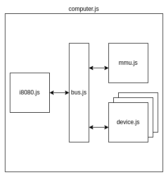
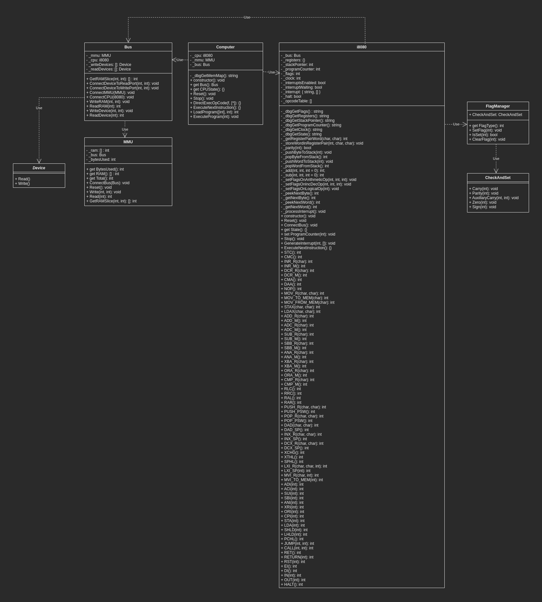

# Intel 8080 JavaScript Emulator <!-- omit in toc -->

This Repo contains:

* [src/core/](src/core/)  
  
   An Intel 8080 CPU emulator, written in JavaScript, and associated components that can be used to build a virtual machine using the Intel 8080 as the CPU.

* [src/emulators/space-invaders](src/emulators/space-invaders)

  A *Space Invaders* emulator which runs the original 1978 game ROM in a modern web browser with a *React*-based front-end (to see this in action, visit: http://8080.cakers.io).

* [src/cpu-test-program](src/cpu-test-program)

  A *CPU Diag* emulator that also runs on the 8080 virtual machine components. This is a piece of software written in 1980 by Kelly Smith of *Microcosm Associates*. It tests the 8080 chip is in full working order. The version in this repo runs in a simple static website and requires a running web-server to use (albeit a small, simple one such as `live-server` or `python -m SimpleHttpServer`).

* [src/unit_tests](src/unit_tests)
  
  Unit tests for nearly all of the 8080 operations written for *Mocha*.

* [utils/test_generator](utils/test_generator)
  
  The Unit Test Generator App (see [Unit Tests](#unit-tests)).
  
* [utils/rom_extractor](utils/rom_extractor)
  
  An app to convert 8080 ROM binary files into JavaScript arrays of bytes. Required so ROM files can be used without having to load them from local filesystems.

* [documentation](documentation)
  
  Various scraps of documents about the design of the app and third-party documentation that was used during development.

* [README](README.md)

  This README.

---

### Table of Contents <!-- omit in toc -->

- [Set-up](#set-up)
- [8080 Core Components](#8080-core-components)
  - [`i8080.js`](#i8080js)
  - [`mmu.js`](#mmujs)
  - [`bus.js`](#busjs)
  - [`device.js`](#devicejs)
  - [Core Component Class Diagram](#core-component-class-diagram)
- [Tutorial: Build an i8080 Virtual Machine and Execute Some Code](#tutorial-build-an-i8080-virtual-machine-and-execute-some-code)
  - [1. Create basic `index.html`](#1-create-basic-indexhtml)
  - [2. Copy `core` files to source directory](#2-copy-core-files-to-source-directory)
  - [3. Create a custom `OutputDevice` by extending the `Device` class](#3-create-a-custom-outputdevice-by-extending-the-device-class)
  - [4. Create the `TutorialComputer` class by extending the `Computer` class](#4-create-the-tutorialcomputer-class-by-extending-the-computer-class)
  - [5. Write the main `tutorial.js` script to be executed through the browser](#5-write-the-main-tutorialjs-script-to-be-executed-through-the-browser)
  - [6. Run the script through a browser](#6-run-the-script-through-a-browser)
- [Testing](#testing)
  - [Unit Tests](#unit-tests)
  - [Running Unit Tests](#running-unit-tests)
  - [Unit Test Methodology](#unit-test-methodology)
  - [CPU Diag (1980)](#cpu-diag-1980)
- [Implementing Space Invaders](#implementing-space-invaders)
  - [Components](#components)
  - [Space Invaders Class Diagram](#space-invaders-class-diagram)
  - [Video](#video)
    - [The Video Buffer](#the-video-buffer)
    - [Colour Palette](#colour-palette)
    - [Rotated Screen](#rotated-screen)
    - [Sound](#sound)
  - [Additional Hardware](#additional-hardware)
    - [Bit-Shift Device](#bit-shift-device)
    - [Controller Devices](#controller-devices)
  - [Game Loop Implementation and the Web Worker](#game-loop-implementation-and-the-web-worker)
  - [Front-End](#front-end)
    - [Control Panel](#control-panel)
    - [Player Instructions](#player-instructions)
    - [Data Tables](#data-tables)
      - [Field State](#field-state)
      - [CPU Register State](#cpu-register-state)
      - [CPU Flag State](#cpu-flag-state)
    - [Disassembly](#disassembly)
    - [Game Window](#game-window)
  - [Running Space Invaders Locally](#running-space-invaders-locally)
- [Appendix A: References and Sources](#appendix-a-references-and-sources)
- [Appendix B: Why JavaScript?](#appendix-b-why-javascript)

---
# Set-up

This project uses various JavaScript libraries for testing, *React* and third-party open-source *React* components. Ensure you run `npm install` in the relevant directories before trying stuff out.

# 8080 Core Components

In `/src/core`, the following JavaScript classes can be used to form a simple virtual machine with an 8080 CPU.

*NOTE: When core components are used elsewhere in this project, they are accessed via symlink to this directory*

  

## `i8080.js`

Class which emulates all 8080 operations and provides an interface to execute 8080 binary code.

## `mmu.js`

A simple class used to hold RAM (in a `Number` `Array`) and provides an interface for reading and writing to the RAM.

## `bus.js`

A class used to connect the CPU, MMU and any additional devices together. CPU operations that use RAM, for instance, only interact with the bus which passes the request to the `MMU`.

Devices are added to `Read` and `Write` arrays in positions that reflect the ports they're hooked up to. For instance, the ['Space Invaders' custom bit-shift device](#bit-shift-device) is added to the `Read` array at positions `2` and `4` and the `Write` array at position `3` because these are the three ports it uses to communicate with the CPU via the `IN` and `OUT` opcodes.

## `device.js`

An abstract class that provides an interface for any device that needs to be connected to the bus. It ensures each device provides a `Read()` and a `Write()` method. It can't be instantiated directly.

## Core Component Class Diagram

Core components and their relationships are below. Raw file is [here](documentation/diagrams/uml-diagrams/core-uml.drawio.png).



---
# Tutorial: Build an i8080 Virtual Machine and Execute Some Code

This section presents a quick tutorial that shows how easy it is to build out a virtual machine using the `core` sources in this repo.

The program that will be run through the machine is very, very simple. It will just add the numbers 40 and 2 together leaving the Accumulator with the number 42. Then it will use a custom-written `OutputDevice` to print that Accumulator value to a browser's console.

## 1. Create basic `index.html`

To begin with, we'll be using the script in the browser, so we need a simple `index.html` file. The script we'll be writing is to be called `tutorial.js` so that needs to be imported using a `<script>` tag.

  ```html
  <!DOCTYPE html>
  <html lang="en">
    <head>
      <title>i8080 JavaScript Tutorial</title>
      <meta charset="UTF-8" />
      <meta name="viewport" content="width=device-width, initial-scale=1.0" />
      <meta http-equiv="X-UA-Compatible" content="ie=edge" />
      <script type="module" src="tutorial.js"></script>
    </head>
    <body>
      <p>i8080 Tutorial Program: Open Debug Tools for any Output</p>
    </body>
  </html>
  ```

## 2. Copy `core` files to source directory

The `core` 8080 source files from the repo copied over to the same directory as the `index.html` file created above.

  ```shell
  ~/Source/i8080-tutorial via ⬢ v16.14.2
  ➜ ls -ltr
  total 104
  -rw-rw-r-- 1 cakers cakers   898 Aug 10 23:07 mmu.js
  -rw-rw-r-- 1 cakers cakers 73643 Aug 10 23:07 i8080.js
  -rw-rw-r-- 1 cakers cakers   218 Aug 10 23:07 device.js
  -rw-rw-r-- 1 cakers cakers  2959 Aug 10 23:07 computer.js
  -rw-rw-r-- 1 cakers cakers  2408 Aug 15 21:50 bus.js
  -rw-rw-r-- 1 cakers cakers   411 Aug 16 10:39 index.html

  ~/Source/i8080-tutorial via ⬢ v16.14.2
  ➜
  ```

## 3. Create a custom `OutputDevice` by extending the `Device` class

Next, create a custom `OutputDevice` class so the result can be written to the console. This is a simple class that extends the `Device` class in `device.js` and implements the `Write()` method which will simply print out the received value to the browser's console.

  ```javascript
  import { Device } from './device.js'

  class OutputDevice extends Device {

      Write(port, val) {
          console.log(val);
      }
  }

  export { OutputDevice }

  ```
Note that the `port` parameter is not used in the code, here, as this device will only be connected to one port. If a device is connected to more than one port, it is useful to split logic depending on which port on the device received the value. For instance, a sound device might play different sounds depending on which port received the value.

## 4. Create the `TutorialComputer` class by extending the `Computer` class

Next, the `Computer` class is extended to create the `TutorialComputer` and hook it up to the `OutputDevice`.

```javascript
import { Computer } from './computer.js';
import { OutputDevice } from './output-device.js';

class TutorialComputer extends Computer {

    constructor() {
        super();
        this._outputDevice = new OutputDevice();
        this._bus.ConnectDeviceToWritePort(0x01, this._outputDevice);
    }
}

export { TutorialComputer }
```
Above, the `OutputDevice` is connected to port 0x01 (1) of the `Bus`. To access this device, the source code needs to use the `OUT` opcode with an operand of `0x01`.

Extending the class, instead of implementing it, may seem overkill for this example but in a lot of cases there will be additional devices to add and different hooks required to emulate OS or ROM functions (see `ExecuteNextInstruction()` in [`cpudiag-computer.js`](src/cpu-test-program/cpudiag-computer.js) for an example of emulating OS API calls without an OS). Extending the `Computer` class helps to decouple specific machine behaviour from the `core` components.

## 5. Write the main `tutorial.js` script to be executed through the browser

Now to write the main `tutorial.js` script which will instantiate the `TutorialComputer` and execute some 8080 binary code. 
  
Code is stored as byte values in an array called `program`. This `program` is loaded into the virtual memory of the `TutorialComputer` object using the `LoadProgram()` method, then the `ExecuteNextInstruction()` method is called to step through it until the `HALT` status of the CPU is set to `true`.

The program is loaded into memory address `0x0` (the default), but this could be changed by passing the `addr` parameter to the `LoadProgram()` method.

  ```javascript
  import { TutorialComputer } from './tutorial-computer.js'

  const computer = new TutorialComputer();

  const program = [
      0x3E,            // MVI A...
      0x28,            // #0x28 (40)
      0xC6,            // ADI A...
      0x02,            // #0x02 (2)
      0xD3,            // OUT...
      0x01,            // ...to Port 0x01 (1)
      0x76,            // HALT
  ]

  computer.LoadProgram(program);
  while(!computer.CPUState.Halt) {
      computer.ExecuteNextInstruction();
  }

  ```

Above, the program loads the immediate value `40` (`0x28`) into the Accumulator, then adds the immediate value `2` (`0x02`) to the Accumulator. It then calls the `OUT` opcode with a parameter of `0x01`, telling the CPU to send the contents of the Accumulator to the device listening on port `0x01` (which is the `OutputDevice` written in step 3). Finally, it uses the `HALT` opcode to stop the program. Without this `HALT` code, the program will keep running through memory trying to execute whatever it finds.

## 6. Run the script through a browser

In order for a browser to run everything over `http` and avoid `Cross Origin` errors, the `index.html` file must be served through an `HTTP` server. Fortunately, there are a number of simple ones out there, including one that ships with `python`. For simplicity, it should be started from the tutorial source directory.

  ```shell
  ~/Source/i8080-tutorial via ⬢ v16.14.2
  ➜ python3 -m "http.server"
  Serving HTTP on 0.0.0.0 port 8000 (http://0.0.0.0:8000/) ...
  ```

There is also [`live-server`](https://www.npmjs.com/package/live-server) which can be installed using `npm` and automatically refreshes if it detects any changes in the source.

If the `index.html` loads correctly, it should look something like this:


Opening the debug tools (CTRL-SHIFT-I on Chrome) and clicking on the `Console` tab, should show output from the program (`42`).


---
# Testing

## Unit Tests 

Unit tests cover nearly all the 8080 operations. They're generated by the [`test_generator.py`](utils/test_generator) app which uses `YAML` config files to generate *Mocha* test-suites. This simple application saves a lot of time in maintaining unit tests that contain very similar boilerplate code but with different inputs and different results.

The `YAML` files are pretty simple. The top section (`test-suite`) forms variables for the whole test-suite such as any boilerplate code and underneath that the `tests` section provides a list of `test` items that provides values for the placeholders in the test-suite boilerplate code.

Below is an example of the `YAML` config file for generating the test-suite for the `RRC` CPU operation.

```yaml
---
test_suite:
  enable: True
  generator_function: rrc_tests.generate_rrc
  description: 'RRC'
  output_file_name: '/rotate/rrc.test.js'
  header: |
    import { Computer } from '../../core/computer.js'
    import { i8080 } from '../../core/i8080.js'
    import { strict as assert } from 'assert'
  footer: |
    });
  boilerplate: |
    const c = new Computer();
    const FlagType = c._cpu._flagManager.FlagType;


    let program = [
      0x3E,           // MVI into accumulator
      {data},         // ...this byte
      0x0F,           // RRC
      0x76,           // HALT
    ]

      c.LoadProgram(program);
      c.ExecuteProgram();

      assert.equal(c._cpu._flagManager.IsSet(FlagType.Carry), {carry});
      assert.equal(c.CPUState.Registers['A'], {expected_result})

      assert.equal(c._cpu._flagManager.IsSet(FlagType.Parity), false);
      assert.equal(c._cpu._flagManager.IsSet(FlagType.AuxillaryCarry), false);
      assert.equal(c._cpu._flagManager.IsSet(FlagType.Zero), false);
      assert.equal(c._cpu._flagManager.IsSet(FlagType.Sign), false);

      assert.equal(c.CPUState.Clock, 18);

      c.Reset();

    }});
    
  tests:

    - test:
      name: Bit 0 set, so should be copied to Carry Flag, then out to MSB
      data: 15
      carry: True
      expected_result: 135

    - test:
      name: Bit 7 not set, so Carry flag and MSB should remain cleared 
      data: 242
      carry: False
      expected_result: 121
```

To generate unit tests:

```shell
➜ cd utils/test_generator
➜ python3 ./gen_i8080_unit_tests.py
```

## Running Unit Tests
Unit tests are written to: `/src/unit_tests` and require Mocha to run (`npm install`). To execute all tests, should be as simple as:


```bash
i8080-javascript/src/unit_tests on  main [!] 
➜ npm run test
```
There are 428 tests in total and all should pass cleanly, and do so at the time of writing.

## Unit Test Methodology
Unit tests are written to closely resemble the way the i8080 programs would be executed through the emulator. Instead of directly accessing internal members of the i8080 class to set-up, execute and tear-down tests, we use small binary programs stored in arrays that consist of a sequence of 8080 opcodes and operands. These are sent to the VirtualMachine for execution, then the state of various components is checked for the result. Basically, Unit tests are all mini 8080 executables.

For instance, one of the tests to check the `JNC` (Jump if Carry Not Set) command executes this sequence of bytes stored in an array called `program`.

```javascript
		let program = [
		  0x3E,                   // MVI into accumulator
		  0xFF,                   // ...this byte
		  0x26,                   // MVI into Register H...
		  0xFF,                   // ...This high-byte
		  0x2E,                   // MVI into Register L...
		  0xFE,                   // ...This low-byte
		  0x36,                   // MVI into memory location (stored in registers H/L)
		  0x76,                   // ...OpCode 0x76 (So the program HALTS when the program counter changes if a jump occurs)
		  0xC6,                   // ADI...
		  0xA,                    // ...This immediate value to accumulator
		  0xD2,                   // JNC
		  0xFE,                   // ..This low-byte
		  0xFF,                   // ...and this high-byte
		  0x76,                   // HALT
		]
```
The above sequence executes the following on the 8080 CPU:

1. Load the immediate value `255` (`0xFF`) into the accumulator (the largest number it can store).
2. Load a 16bit memory address (`0xFFFE`) into the `H` and `L` registers
3. Call the `MVI` command to load immediate value `0x76` (the HALT opcode) into the 16bit address now loaded into the `H` and `L` registers (`0xFFFE`). This ensures that, if the code does jump to this location, the program will end.
4. Add the immediate value `10` (`0xA`) to the accumulator, which should set the CPU Carry bit.
5. Call the `JNC` instruction. 
6. HALT the program.

The expected result of this test is that a jump should *not* occur because the carry bit was set during the `ADD` operation in step 4. The test will pass or fail, therefore, depending on the value of the CPU's Program Counter field when the test is complete.

## CPU Diag (1980)

CPU Diag is an 8080 assembler program written in 1980 by Kelly Smith of *Microcosm Associates*. It’s full source can be found in this repo in [documentation/cpu-diag/cpu-diag.asm](documentation/cpu-diag/cpu-diag.asm). It's tests the functionality of the 8080 chip and, therefore, was the first piece of software I wanted to get running in the emulator.

The program runs as a small, static website and requires a simple local web server to run such as the one that ships with Python:

```shell
➜ cd src/cpu-test-program
➜ python -m SimpleHttpServer
```
Once the server is running, select the `cpudiag-page.html` file to load the main screen.

The back-end of the program runs in a similar way to *Space Invaders* so details won't be repeated here, suffice to say that a Web Worker is used to decouple the interface from the emulator and prevent the browser from locking up.


CPU registers and fields are displayed along the top. On the bottom left is the trace window which outputs a disassembly of each instruction as it executes. In the middle is the console output and on the right, the RAM contents. 

The buttons in the middle provide a couple of different ways to run the program which helped when debugging.

* `Run Clocked at Speed` slows down the emulator to a number of instructions per second. This is really just so you can observe the fields being updated as the test runs.
  
* `Run Unclocked` executes the whole program as quickly as possible.
  
* `Step Single Instruction` allows you to step through the program instruction-by-instruction.
  
* `Run to Breakpoint` will execute the program up to the memory address entered in the text-box.

The expected result is for the phrase `  CPU IS OPERATIONAL` to pop out of the console. If there are any issues, the phrase `  CPU HAS FAILED!` will pop out instead. This text output actually used some old CP/M kernel routines that had to be trapped and emulated. See `ExecuteNextInstruction()` in [`cpudiag-computer.js](src/cpu-test-program/cpudiag-computer.js) for details.

*NOTE: Time invested in unit testing pays off! When I first ran this program, I expected to be mired in 8080 assembler debugging because I anticipated plenty of failures. In fact, the only issue I encountered was with the `DAA` instruction, an instruction that I hadn’t fully implemented, yet, and hadn’t written any unit tests for. A lot of 8080 emulators actually skip this instruction because it wasn’t used very much, at least in games. I was in two-minds on whether to implement it myself or skip it. In the end, it is fully implemented and passes all tests in `CPU Diag`.*

---
# Implementing Space Invaders

*Space Invaders* seemed a logical, if slightly cliched choice for emulation, but it also has a great write-up on [Computer Archeology](https://www.computerarcheology.com/Arcade/SpaceInvaders/) and there are a few other implementations out there so, if I got stuck, I had references available. The [Hardware](https://www.computerarcheology.com/Arcade/SpaceInvaders/Hardware.html) section in the above link provides the most useful information.


## Components

Below is the updated class diagram that includes the additional *Space Invaders* components. Again, click for larger version.

## Space Invaders Class Diagram

Raw diagram can be found, [here](/documentation/diagrams/uml-diagrams/space-invaders-uml.drawio).


## Video

As this is a computer game, there were a number of things to consider when it comes to graphics, even if they're primitive by today's standards.

### The Video Buffer

According to [Computer Archaeology](https://www.computerarcheology.com/Arcade/SpaceInvaders/Hardware.html), the 8080 *Space Invaders* video memory is located between addresses `0x2400` and `0x3FFF`. Hardware in the arcade cabinet would read this section of RAM and interpret the data into electronic signals to be sent to the monitor which would draw data out one line at a time from the top down. 

When the screen is half-way drawn, an interrupt is sent to the CPU which we'll call the 'half-blank interrupt', and, similarly, when the screen is fully drawn, another interrupt is sent to the CPU, which we'll call the 'Vertical Blank' interrupt.

The screen-updates and interrupt firings must be in sync or you will see a side-effect known as 'tearing'. Imagine if the monitor has just drawn the top of a sprite at position (0,1) but, before it finished, the video RAM updates the sprite to position (0,5). The rest of the sprite will be drawn to screen in this different position, making it look disjointed or 'torn'.

In *Space Invaders*, the interrupts are also critical for game timing and a lot of update code depends on them being fired at exactly the right point. Having said that, this emulation doesn't quite manage this. Instead of firing the half-blank when the screen is halfway draw and the full-blank when the screen is fully drawn, it only sends one interrupt after the whole screen is drawn and toggles the interrupt type each time (see `run()` in the [`invaders-web-worker.js`](src/emulators/space-invaders/src/web-workers/invaders-web-worker.js) module). Testing determined this was enough to keep the game running at a decent speed.

### Colour Palette

Each pixel in the display is represented by 1 bit of video RAM. If the bit is `0` then the pixel is off, or black, if it's `1` then it is on, or white. Screenshots and photographs of the early arcade cabinets may show alien and player spaceships in different colours, but that was just a trick achieved by sticking coloured cellophane over certain sections of the monitor.

Certainly, one advantage of a black and white screen is efficiency when updating the screen. We always clear the entire frame to black, then only have to worry about drawing the white pixels.

### Rotated Screen

For *Space Invaders*, the video buffer is written at a 90 degree angle. Back in the '70s, they simply rotated the monitor in the arcade cabinet by 90 degrees to set it upright. In this emulator, it's resolved by temporarily rotating the context of an HTML canvas by 90 degrees, writing out the contents of the video buffer, then rotating the context back, all in one frame.

See the `useEffect()` function in the [Screen.jsx](src/emulators/space-invaders/src/components/game-cabinet-components/Screen.jsx) component which fires each time the `VRAM` state changes.

### Sound

Sound is not yet implemented in the emulator, but will be eventually. A sound device is prepared and hooked up, it just doesn't do anything, yet.

## Additional Hardware

The Space Invaders arcade machine included some additional, custom hardware that connected to the 8080 through device ports and communicated using the `IN` and `OUT` opcodes.

### Bit-Shift Device

A hardware shift register was added to the original *Space Invaders* cabinet and used when computing the positions of sprites. The 8080 only has instructions that allow bit-shifting one bit at a time. This additional [Bit-Shift](src/emulators/space-invaders/src/back-end/bitshift-device.js) hardware permits multiple bit-shifts in less instructions.

A byte sent to the device on port 2 tells the register how many bits to shift, and a byte sent to port 4 adds to the data to shift.

The device will output the shifted data to port `3`.

The `BitShift` class implements the `Device` abstract class and is added to `Bus` on read port `3` and write ports `2` and `4` in this emulator.

### Controller Devices

Additional controller devices are also implemented, though, at the time of writing, only the Player 1 controls have been implemented (these are just standard JavaScript Events connected to `EventListener` of the `Window` object which fire messages to the Web Worker as the player pushes down keys etc.). Again, they are simply implemented from the `Device` abstract class and added to the correct ports of the `Bus`.

## Game Loop Implementation and the Web Worker

Ideally, when running software through an emulator, you would employ a tight loop so instructions can be executed one after the other and in-between these instructions, the screen can be repainted.

The problem with this is that browsers are, by default, single-threaded and synchronous. JavaScript is executed in the same thread as the browser updates, so any scripts that take too much time interfere with the repainting process and your program hangs. In fact, often the browsers will present a warning dialog informing you that no response has been received in a while and would you like to wait or kill the process. 

The solution was to take the emulator's loop away from the main browser and have it run in a separate thread. This is achieved through the use of [Web Workers](https://developer.mozilla.org/en-US/docs/Web/API/Web_Workers_API/Using_web_workers), essentially scripts that can be told to run separately from the main browser and controlled via messages. This has the added advantage of utterly decoupling the emulator from the GUI.

For *Space Invaders* (and *CPU Diag*) Web Workers are used to run the programs in the 8080 emulator and  swap event messages with the main *React* application running in the browser. 

View the [Space Invaders Web Worker](src/emulators/space-invaders/src/web-workers/invaders-web-worker.js).

View the [CPU Diag Web Worker](src/cpu-test-program/cpudiag-worker.js)

## Front-End

The front-end is a basic *React* application.


### Control Panel

The Control Panel, on the far-right, allows you to control the program:

| Button                | Description                                                                                                      |
|-----------------------|------------------------------------------------------------------------------------------------------------------|
| Disable Trace         | Allows you to stop the Disassembly window from updating as the program runs.                                      |
| Play Space Invaders   | Start the game at full speed                                                                                     |
| Pause Game            | Stop the game running  - the game can be resumed by clicking 'Play Space Invaders' or by 'Step Next Instruction' |
| Reset Computer        | Restart and refresh the game                                                                                     |
| Step Next Instruction | Execute the next instruction (all diagnostic tables will be updated if this button is clicked)                   |
| VBlank Interrupt      | Send a VBlank Interrupt signal to the CPU                                                                        |
| Half-VBlank Interrupt | Send a Half-VBlank Interrupt signal to the CPU      

### Player Instructions

Instructions for playing the game can be found underneath the control panel. 

For mobile devices, touch-screen buttons will be visible that allow users to play the game on their device without needing keyboard.


### Data Tables

Note that during standard execution (from hitting the `Play Space Invaders` button) these tables will not be updated in real time. This was attempted, but the sheer number of messages coming back from the Web Worker slowed down the screen updates too much. The tables are updated to their latest values only when `Pause` is clicked. For `Single-Step-Instruction` they are updated immediately.

#### Field State

The table on the top-left displays the state of miscellaneous internal fields - the Program Counter, the Stack Pointer and whether interrupts are currently enabled.

#### CPU Register State

This table display the current values stored in the CPU registers.

#### CPU Flag State

This table displays the current status of each of the CPU Flags

### Disassembly

This window displays the last 1000 executed instructions. It is updated as the program executes and during the `single-step-instruction` command.

### Game Window

This window simply displays the graphics of the game and where it is controlled from.

## Running Space Invaders Locally

*Space Invaders* can be run locally through the *React* development server, but you must make sure that you run `npm install` from the correct directory to ensure all required libraries and components have been downloaded to your machine.

```shell
i8080-javascript/src/emulators/space-invaders on  main is 📦 v0.1.0 via ⬢ v16.14.2 took 17s 
➜ npm install  
```
Once this has been done, from the same directory, type:

```shell
➜ npm start
```
---

# Appendix A: References and Sources

### [8080 Programmers Manual](https://altairclone.com/downloads/manuals/8080%20Programmers%20Manual.pdf) <!-- omit in toc -->
The main source for this emulator - everything you need to know about every OpCode and the way the CPU operates.

### [Computer Archeology: Space Invaders](https://www.computerarcheology.com/Arcade/SpaceInvaders/) <!-- omit in toc -->
Low-level implementation details about the inner-workings of Space Invaders

### [CPU Diag Source](https://github.com/ddelnano/8080-emulator/blob/master/cpudiag.asm) <!-- omit in toc -->
Source Code for the 'CPU Diag' program that tests the 8080 

### [One Lonely Coder NES Emulator from Scratch](https://www.youtube.com/playlist?list=PLrOv9FMX8xJHqMvSGB_9G9nZZ_4IgteYf) <!-- omit in toc -->
JavidX9 has an excellent (and free!) YouTube channel where he instructs and discusses a wide range of low-level technical topics in a very accessible and entertaining way. His tutorial on building a NES emulator was an early inspiration.

### [Emulator 101](http://www.emulator101.com/) <!-- omit in toc -->
A great site to start off with. Provides a lot of information on what you should expect when you start running emulators for the first time and possible pitfalls.

### [Intel 8080 OpCode List](https://pastraiser.com/cpu/i8080/i8080_opcodes.html) <!-- omit in toc -->
If, like me, you were confused about the Aux Carry flag, this link makes it easily understandable, even though it's a different chip.

# Appendix B: Why JavaScript?

Originally, this project was started in `C`. After all, research suggested this was the language most people wrote their emulators in and would also serve to illustrate just how fucking hard-core I was when it comes to programming, but a few issues presented themselves early on:

- Emulating 8080 software, in particular games, means drawing graphics and controlling sprites. For C, some sort of display library like `SDL` would need to be used and, therefore, studied, whereas a modern web browser has all that capability built-in and can easily controlled using a well-known and ubiquitous scripting language.

- This is a personal research project, but I still want people to be able to access a demo easily without having to download an executable and deal with all those hand-wringing security issues, plus I didn't want to have to provide a set of executables for different OS types. This way, I can just stick it on the web. For instance, here: [http://8080.cakers.io](http://8080.cakers.io).

- Chromium-based browsers have great dev tools built in. It was either that or spending some more quality time with `GDB` which - and I'm sorry - just isn't pretty enough.

- Time is a factor. I have a family and work on the emulator could only really be done when a couple of hours were snatched each evening or during nap-time (the baby's, not mine). I didn't want to spend those precious few hours chasing down endless, fucking segmentation errors. A high-level language with great, visual debugging tools available is far better suited to this endeavour.